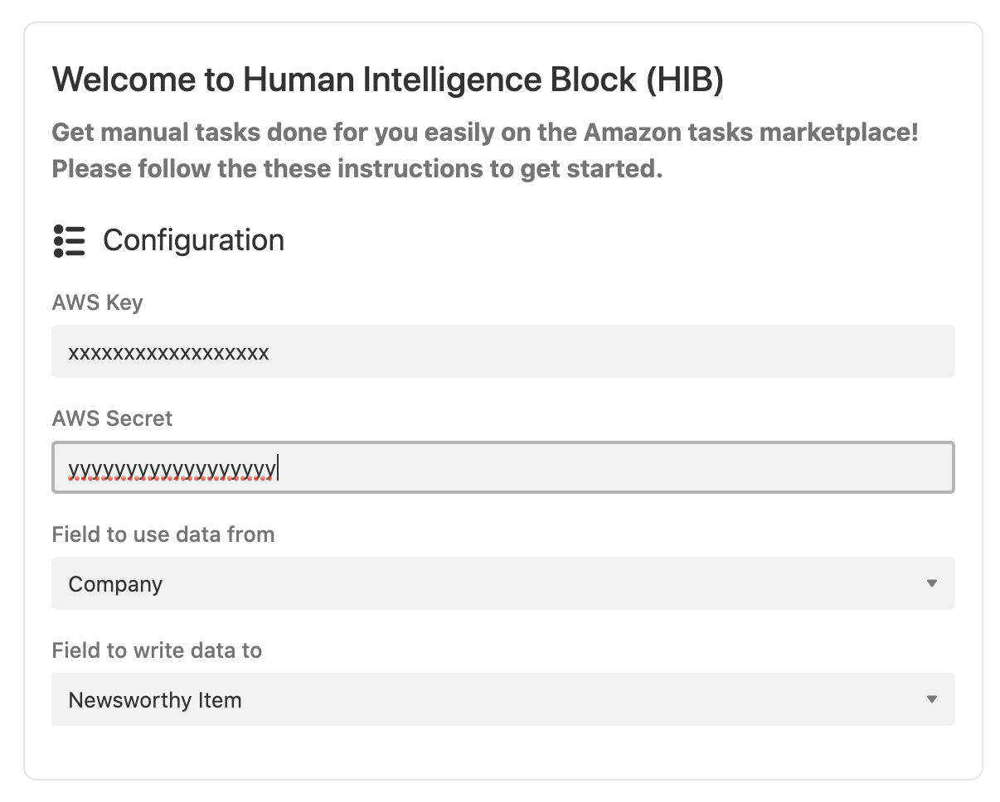
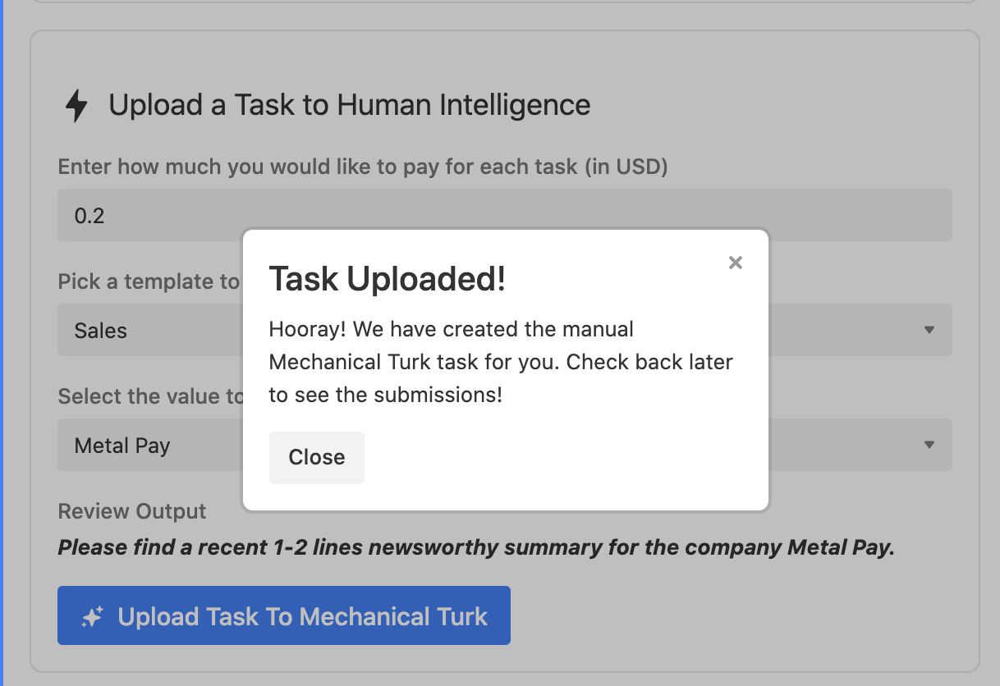
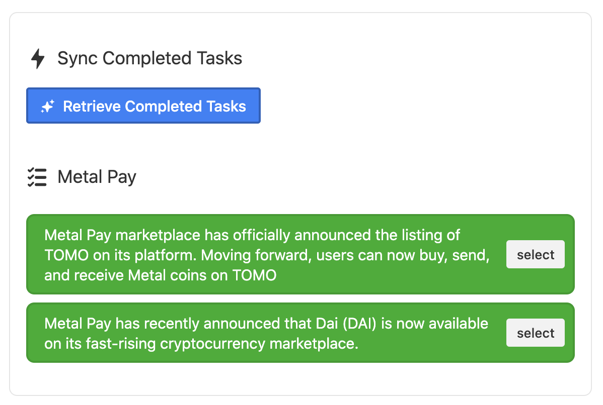
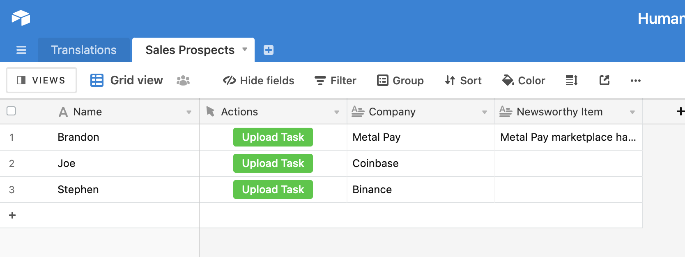

# Human Inteligence Custom Block

## Inspiration
As an indie game developer, we have limited resource as we are a small studio. Therefore, we fork out some of the small piecemeal work to third party workers via Amazon Mechanical Turk. Amazon Mechanical Turk (MTurk) is a marketplace for completion of virtual tasks that requires human intelligence. The Mechanical Turk service gives businesses access to a diverse, on-demand, scalable workforce and gives Workers a selection of thousands of tasks to complete whenever it's convenient.

Prior to discovering Airtable, we were using manual spreadsheets to keep track of tasks that the third parties on the Amazon human intelligence were doing for us and tracking the results manually, and the whole process was tedious and messy.

## What it does

With the Human Intelligence Remote Block, it is now possible to add in some manual processing by human intelligence to Airtable. The block is extensible enough to allow for many use cases that need some human intervention and processing.

We strive to eat our own dog food with a few specific use cases that we are doing:

Use Case 1.) Since we are located in Canada and there are 2 official languages (English and French), we need customized localizations for our apps and games (Google Translate doesn't do a good enough of a job. Thus we use actual humans via Amazon Mechanical Turk to help us translate our texts in the app for us.

Use Case 2.) We are constantly prospecting other companies to do partnerships with us, so we have a sales spreadsheet that we use to email prospects. What we found was that the reply rate was much higher if we can add some context about the company we're emailing, and thus our other use case involves getting a third party to do some research about a recent news/noteworthy event for that company we are looking to engage with. Again Airtable is a great help here, as it allows us to automatically create and upload tasks to Mechanical Turk and to retrieve the responses from these human intelligence workers and use it in our spreadsheet.

While building this block, we realize we need to be flexible since Airtable supports many different use cases (which is why Airtable is much better than a spreadsheet), so we created a way for people to create custom templates (ie. instructions to workers) that they can use for their use case prior to sending to Mechanical Turk. Thus, true to the spirit of Airtable, we allow users to create their own tasks that they want to post to the Mechanical Turk marketplace.

We are also using the newly released Button feature to activate the block so it's easy for a user to activate and upload a task easily.

## How we built it

We are using the custom blocks to integrate with the UI (thanks Airtable team for the awesome documentation). We do have a backend server that handles the creation of the tasks to be posted on to the human intelligence marketplace and to retrieve the tasks. 

## Challenges we ran into

It was really about learning how the mehanicism of read and updating the data and syncing with the Airtable UI. 

We would like to have the backend update the syncing automatically (currently the user has to click a button to sync the responses from the human intelligence marketplace).

## Accomplishments that we're proud of

## What we learned

Before we started looking into AirTables, we thought Airtable was just another Google Sheets competitor. After I saw the use cases and the things that blocks can do, we were a bit blown away. There's only a few use cases listed on the main site, but the extensibility of the blocks and scripts is much better than Sheets. I think prehaps listing more use cases on the site would be good for potential users to find the Aha moment.

The team knew React before this, but this is a good exercise to refresh our memory!

## What's next for Human Intelligence Remote Block

- I would like to make this plugin not require a backend, so prehaps adding instructions to deploy to a serverless context would be beneficial if people find that useful.

- The marketplace has an option to only include certain workers from certain geographic regions. That would be a nice addition to add to the block configuration.

- The marketplace has an option to set the max number of results from workers. We set it to 2 because we want to make sure the data comes back more or less matches and is consistent. That would be a nice addition to add to the block configuration if users find it useful to be able to vary this.

## Screenshots

# Installation
Currently, there is a frontend and a backend component of this, since the backend is the actor that sends in the API requests to Amazon's human marketplace. In the future, this could be refactored into a serverless deploy, but for now, you can navigate to the server folder, then install the gems necessary to run the poject and then issue `rails c` to start the server.
